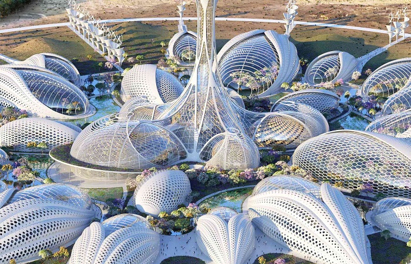
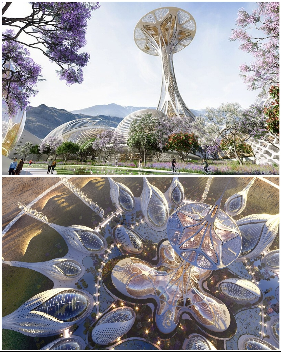
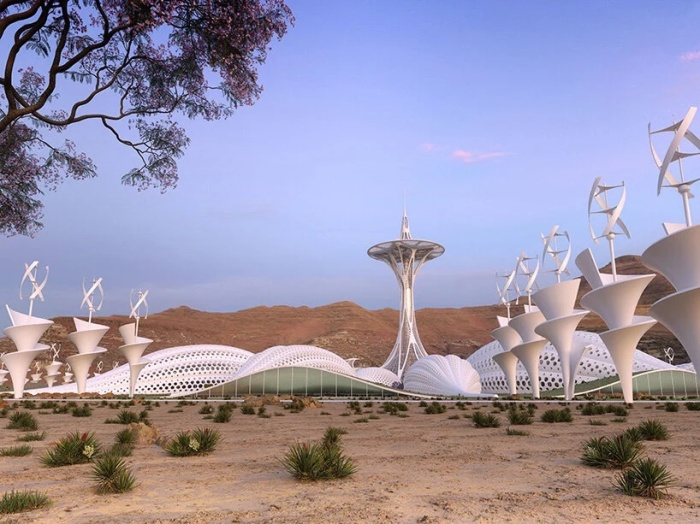

# A futuristic nature park concept made in the form of a flower

Vincent Callebaut, a renowned architect who reflects global environmental issues in his work, presented another amazing concept. "Insect Refugee Camp" is a project designed to draw public attention to the decline of pollinator populations. This futuristic object added to the piggy bank of virtual tours of museums, galleries and memorial sites to visually show its vision of the problem and raise awareness of the catastrophic decline of the planet's biodiversity.

Vincent Callebaut and his architectural firm Vincent Callebaut Architectures have once again proved that environmental issues are no stranger to modern architecture. The Belgian architect presented the concept of Pollinator Park, which aims at raising awareness about the decline in biodiversity of nature, particularly the catastrophic decline in the population of insects and animal pollinators.

- As of 2020, pollinators are indeed at risk of extinction, 100 to 1,000 times the acceptable rate, as stated by the United Nations. Conceived as a call to humanity to restore the broken connection between humans and nature, the author with his project seeks to protect ecosystems in order to stop the death of the creatures that sustain plant life.

- Synopsis: Pollinators are biotic agents that transport pollen between male and female flower structures. They are responsible for propagating about 70% of the plants on earth, providing a third of the world's food supply. Biotic agents include bees, bumblebees, wasps, flies, butterflies, ants, beetles, as well as bats, hummingbirds, orioles and tropical woodpeckers.

According to the editorial office, the "Pollinator Park" was created in cooperation with the European Commission in the framework of the EU initiative on pollinators. Although the project is not planned to be realized, but its development will bring its contribution in informing people of the planet about this problem. All the more so because it was also possible to create an informative virtual tour, which immerses not only in the fantastic world of architecture.

